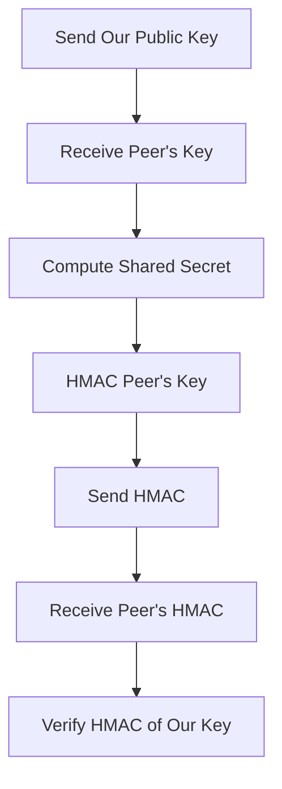

# DHKE (Diffie-Hellman Key Exchange) Library

## Overview

This library implements the Diffie-Hellman Key Exchange (DHKE) protocol, a cryptographic method for securely exchanging cryptographic keys over a public channel. It allows two parties to establish a shared secret that can be used for encrypted communication.

## How It Works

1. **Key Generation**: Each party generates a private key and a corresponding public key using a predefined prime number and generator.
2. **Public Key Exchange**: The parties exchange their public keys over an insecure channel.
3. **Shared Secret Computation**: Each party computes the shared secret using their private key and the other party's public key. The result is identical for both parties.
4. **HMAC key verification**: Hmac keys exchange and verification to detect any MITM (Man-in-the-middle) attacks.

### Key Exchange Flow Diagram



The library ensures that the shared secret is never transmitted, making it secure against eavesdropping.

## Features

- Secure key exchange using the Diffie-Hellman protocol.
- Configurable prime number and generator for flexibility.
- Lightweight and easy to integrate into existing applications.

## Installation

To use this library, clone the repository and include it in your project:

```bash
git clone https://github.com/Bosiux/dhke.git
cd dhke
```

## Usage

### Example: Client host

```c
void run_client(const char *server_ip) {
    int sockfd;
    DHKE_Context ctx;

    protocol_init_connection(&sockfd, ROLE_CLIENT, server_ip);
    dhke_init(&ctx, NULL, NULL);
    dhke_generate_key_pair(&ctx);

    if (protocol_perform_dhke(sockfd, &ctx)) {
        fprintf(stderr, "DHKE failed\n");
        return;
    }

    char msg[MAX_MSG_LEN];

    while (1) {
        printf("Enter message (empty to quit): ");
        if (!fgets(msg, sizeof(msg), stdin)) {
            break; 
        }

        msg[strcspn(msg, "\n")] = '\0';

        if (strlen(msg) == 0) {
            break; 
        }

        protocol_send_secure(sockfd, &ctx, (uint8_t*)msg, strlen(msg) + 1);
    }

    close(sockfd);
}
```

### Example: Server host

```c
void run_server() {
    int sockfd, new_sock;
    DHKE_Context ctx;
    struct sockaddr_in serv_addr, client_addr;
    socklen_t addr_len = sizeof(client_addr);

    protocol_init_connection(&sockfd, ROLE_SERVER, NULL);
    dhke_init(&ctx, NULL, NULL);

    printf("Server waiting for connections...\n");

    while (1) {
        new_sock = accept(sockfd, (struct sockaddr*)&client_addr, &addr_len);
        if (new_sock < 0) {
            perror("accept");
            continue;
        }

        printf("Client connected.\n");

        dhke_generate_key_pair(&ctx);
        if (protocol_perform_dhke(new_sock, &ctx)) {
            fprintf(stderr, "DHKE failed\n");
            close(new_sock);
            continue;
        }

        while (1) {
            uint8_t buffer[PROTOCOL_BUFFER_SIZE];
            int len = protocol_receive_secure(new_sock, &ctx, buffer, PROTOCOL_BUFFER_SIZE);

            if (len <= 0) {
                printf("Client disconnected or error occurred.\n");
                break;
            }

            printf("Received (%d bytes): %.*s\n", len, len, buffer);
        }

        close(new_sock);
        printf("Waiting for next connection...\n");
    }

    close(sockfd);
}
```

### Using as a Library

To integrate this library into your application:

1. Include the [`dhke.h`](https://github.com/Bosiux/dhke/blob/master/include/dhke.h) header file in your project.
2. Initialize the `DHKE` structure with a prime number and generator using `dhke_init`.
3. Use the components in [`protocol.h`](https://github.com/Bosiux/dhke/blob/master/protocol/protocol.h) to perform the key and data exchange.

## TODO

- Design a better prime generation algorythm to assert safer comunication and an harder decryption attempt.

## Contributing

Contributions are welcome! Submit your issues or pull requests to improve the library.

## License

This project is licensed under the GPL-3.0 License. See the `LICENSE` file for details.